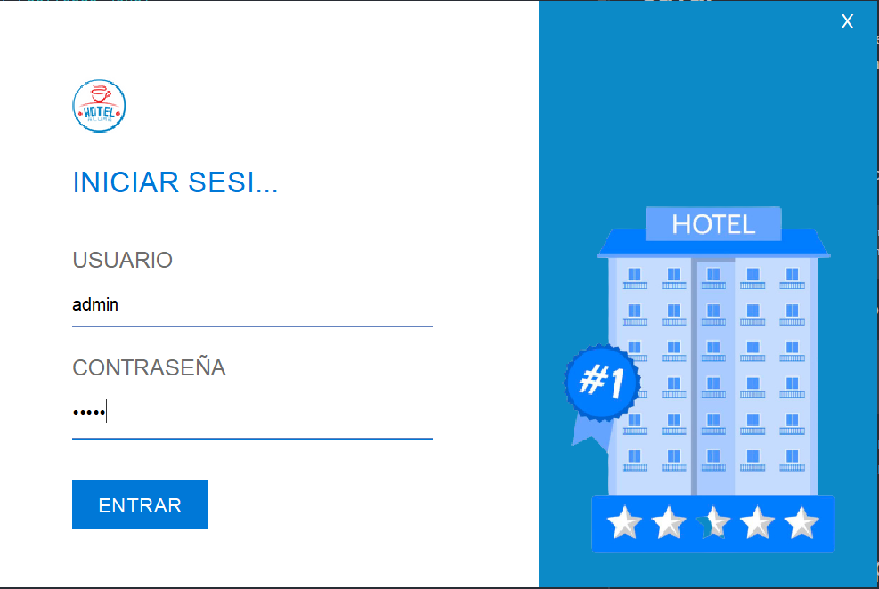
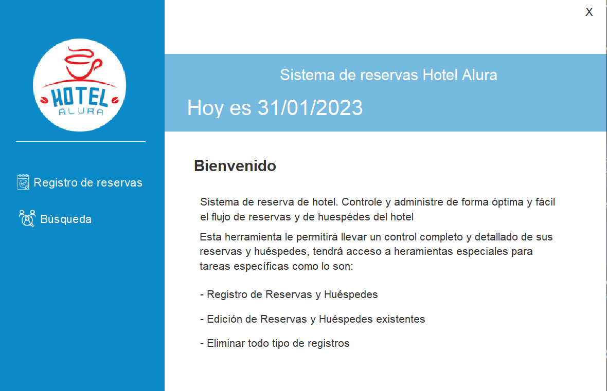
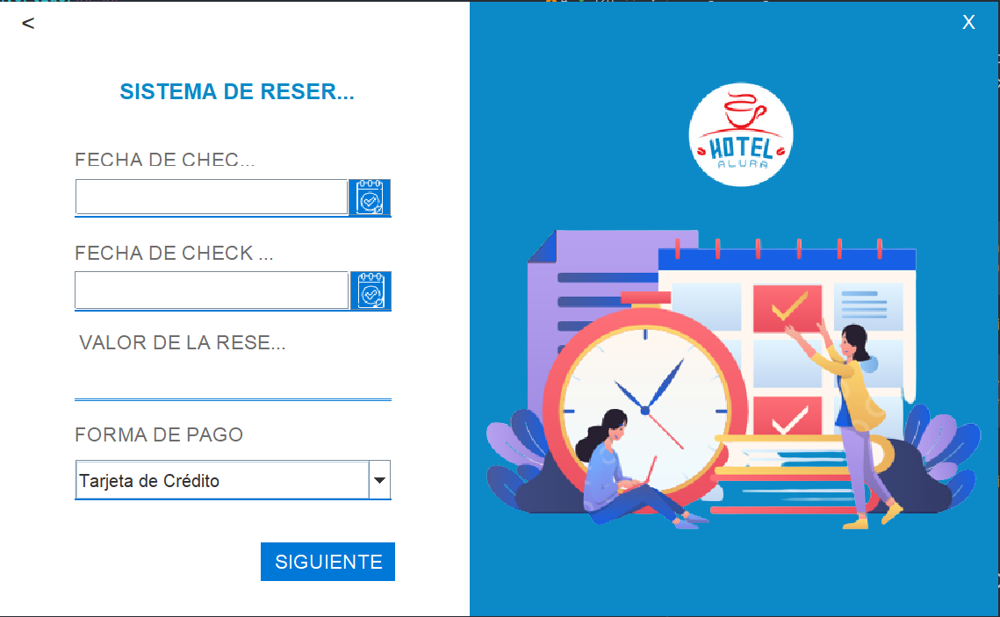
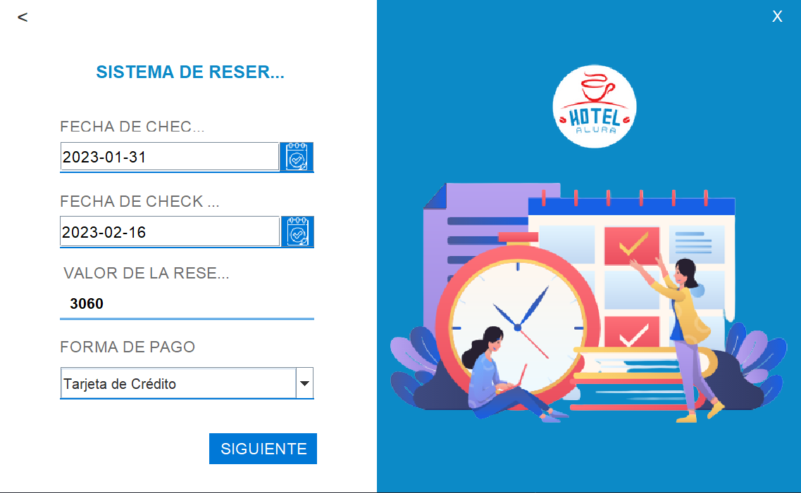
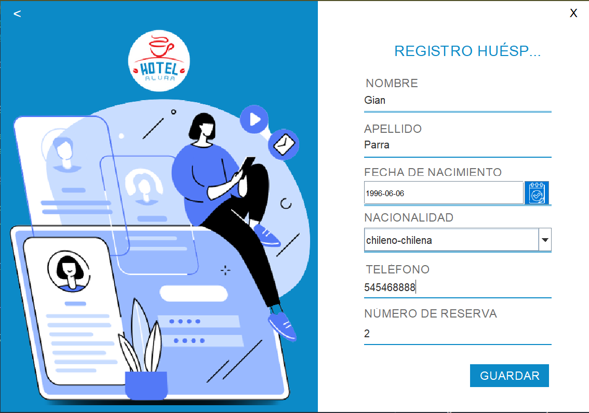
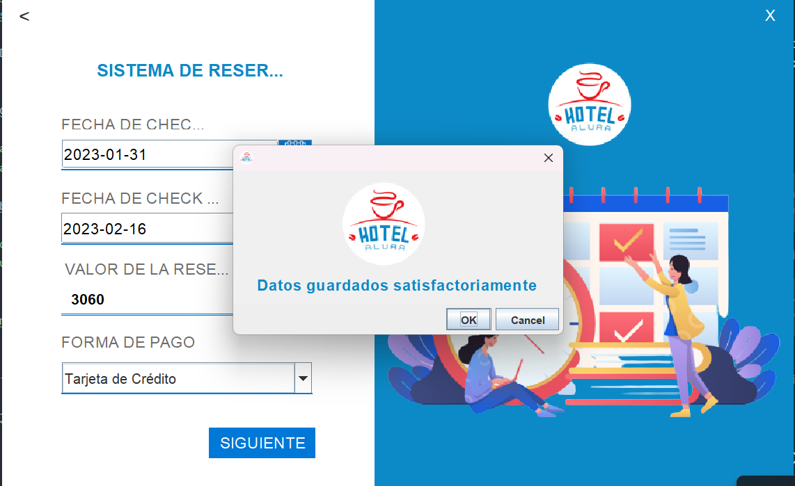
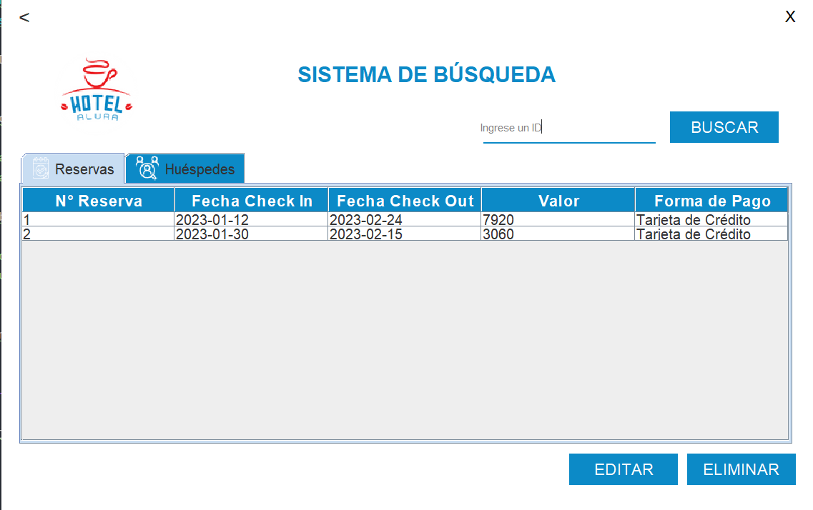

# **_**Challenge ONE | Java | Back-end | Hotel Alura**_**

     

---

## 🚧 Proyecto

Challenge Hotel Alura, realizar un sistema de gestion de reservas y personas para un Hotel.

---

## ⚠️ Importante! ⚠️

☕ Use Java versión 11 o superior para compatibilidad.   

---

## 🖥️ Tecnologías Utilizadas:

* Java 11
* Programación Orientada Objetos
* Clases
* Herencia, Polimorfismo.
* Data Factory
* Lambda
* DAO (Data Access Object)
* MVC (Model - View - Controller)
* Java Swing
* Sobrescritura de métodos
* Creación de base de datos
* Consultas SQL

---
##### ***Data Base Connector MySQL***

> **Creacion de Base de Datos**
> 
> create database Hotel_alura;
> 
> create table Huespedes( id int auto_increment, nombre varchar(50) not null, apellido varchar(50) not null,
FechaNacimiento date not null,nacionalidad varchar(50) not null,telefono varchar(15) not null,IdReserva int, primary key(id) )engine = InnoDB;
>
>create table Reservas( id int auto_increment, FechaEntrada date not null,
FechaSalida date not null,Valor varchar(250),FormaPago varchar(250) not null, primary key(id) )engine = InnoDB;
>
>ALTER table Huespedes ADD foreign key (IDRESERVA) REFERENCES RESERVAS(ID);
>
>select * from Reservas;
>select * FROM HUESPEDES;

---

     

---

     

---

     

---

     

---

     

---

     

---

     

